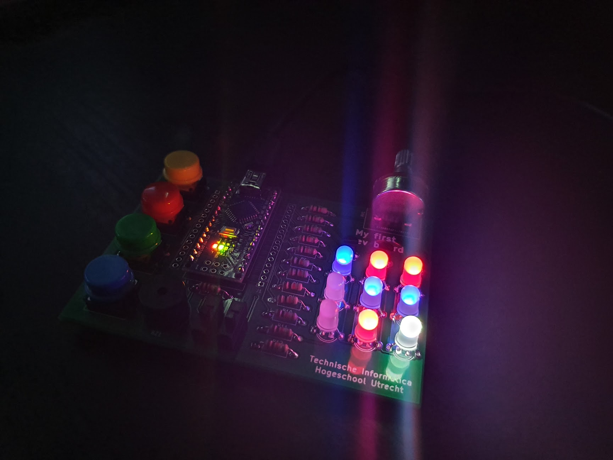

# mfd-tic-tac-toe



Tic-Tac-Toe for the [myFirstDevBoard](https://github.com/CvRXX/myFirstDevBoard).

```
Welcome to Tic-Tac-Toe

How this game works:
1. Decide which player plays with blue and red (alternative to cross and circle)
2. Press the yellow button to start a new game
3. The frame will light up either red or blue, indicating which player can go first
4. After 5 seconds the main game loop will start

The current player can select where he wants to place his cross/circle with the potentiometer.
Confirm the selected position by pressing the button with your color (red/blue)
As soon a player wins the LEDs will blink the winning row alternating
between the winning color and white to indicate which row won the game.

- After the game has ended you can press the yellow button to start a new game
- You can press the green button to display which player's turn it is
```
*This is not 100% accurate, but the game generally plays as described above.*


## How to build

You need [wovo/hwlib](https://github.com/wovo/hwlib) and [wovo/bmptk](https://github.com/wovo/bmptk).  
It's probably the easiest to use [wovo/installers](https://github.com/wovo/installers) to install everything.

Then just use `make` to build and/or `make run` to build + flash to your mfd board.

It's recommended to define `VOID_COUT` in cout.hpp for performance reasons.
